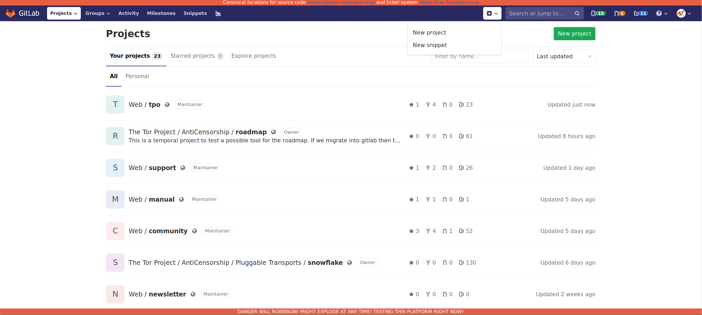
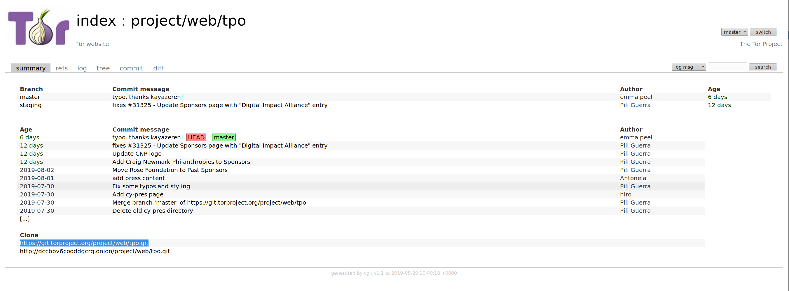
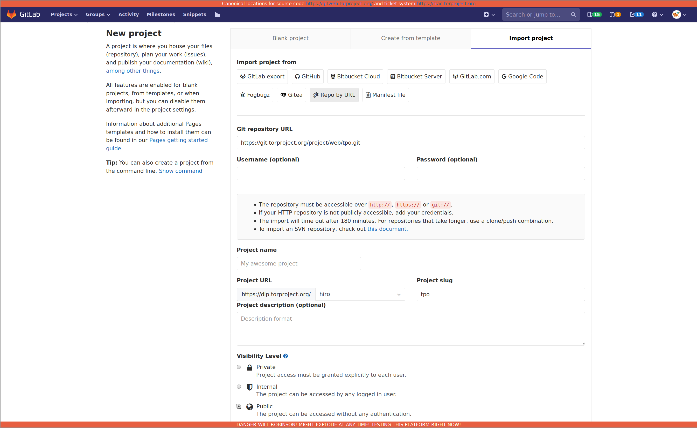
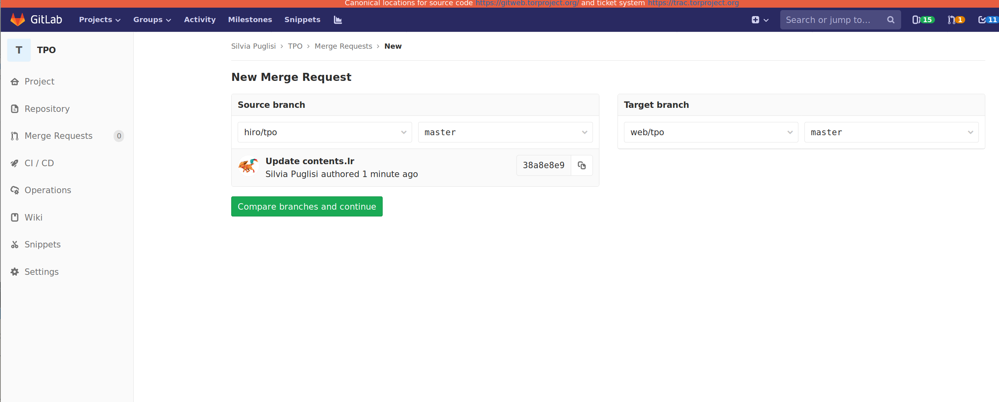

Projects in the WEB group use a loose git workflow. 

Staging, Develop and Master Branches

Instead of a single *master* branch, this workflow uses **two** branches to record the history of the project and one extra branch to test out features and changes on our staging environment. The *master* branch stores the official release history, the *develop* branch serves as an integration branch for features, finally the *staging* branch has to be considered a dirty branch that can be overwritten and used for testing new features. 

## How to send a merge request or propose a change

1.  Make a clone of the tor git repository. All the repositories in the WEB group have a single source of truth: [https://gitweb.torproject.org/project/web/](https://gitweb.torproject.org/project/web/)

It is recommended that you clone from tor git even if you want to create a repository under your user space in dip.

2.  Create a new branch for the changes you want to make and start editing the files you want. Gitlab will suggest to create a merge request. You can share the merge request link with the others developers to have the change merged.

### How to clone a tor git repository in dip

The following instructions are meant for users that want to use dip web interface and are not familiar with git. If you are proficient with git move along, nothing to see here for you ;)

1.  Go to your projects dashboard: [https://dip.torproject.org/dashboard/projects](https://dip.torproject.org/dashboard/projects) 

2.  Click on the + icon next to the search box. And on "New Project"

3.  Got to the project you want to clone on tor git and select the clone link

4.  Use the link to clone the repository in dip by clicking on "Import Project" in the new project page

5.  Finally click on "Create Project"

### How to create a merge request in dip

So you have some changes ready to merge. Here is how you create a merge request.

1.  Go to your project merge requests page: https://dip.torproject.org/<username>/<project>/merge_requests

2.  Click on New merge request

3.  Select the source branch and change the target branch to use the upstream project in dip:

4.  Click on "Compare branches and continue" 

## How to merge from a branch or third party repository.

When you are merging from a branch or third party repository make sure to edit the commit message in a way that other contributors now what you are doing.

If you wanted to be nicer you could also simply merge commits from the branch so that you keep the commit messages of the initial contributor.

