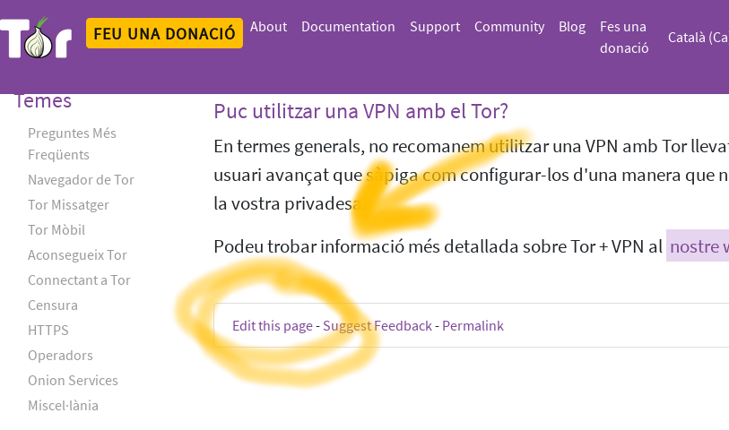
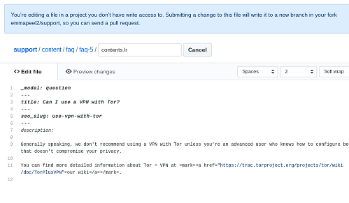

Some lektor-based websites have an **edit button** that you can use to submit small corrections:

You will be presented with the file that generates the page:

Once you have made your changes, change the title and description of them to make it more descriptive (add the ticket link if there is any)

Create a pull request for your contribution to be reviewed.